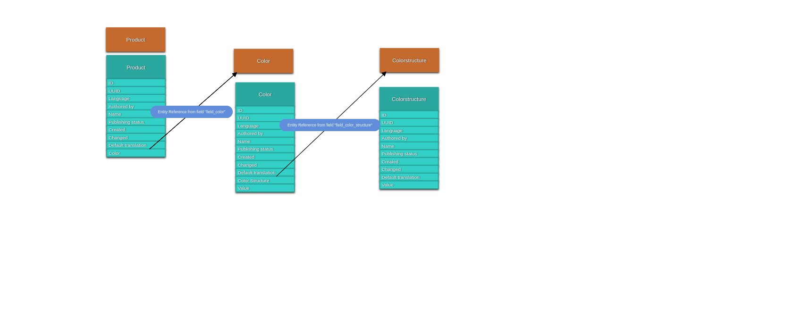

# Example 1: Using Drupal Console 

I did this example using the [lando](https://github.com/lando/lando) environment with Drupal 8.4

When finished we will have 3 Entities. The relationship between them will be like this:



You can make this kind of graphics with [Entity-Relation-Diagram](https://www.drupal.org/project/erd)

Steps:

### Create the Module

```
$ drupal generate:module  \
--module="customentity" \
--machine-name="customentity" \
--module-path="/modules/custom" \
--description="Custom Entity" \
--core="8.x" \
--package="Custom" \
--module-file \
--composer \
--test \
--twigtemplate \
--learning \
--uri="http://default" \
--no-interaction
```

### Create the Product Class

```
$ drupal generate:entity:content  \
--module="customentity" \
--entity-class="Product" \
--entity-name="product" \
--base-path="/admin/structure" \
--label="Product" \
--is-translatable \
--learning \
--uri="http://default" \
--no-interaction
```

### Create the Color Class

```
$ drupal generate:entity:content  \
--module="customentity" \
--entity-class="Color" \
--entity-name="color" \
--base-path="/admin/structure" \
--label="Color" \
--is-translatable \
--learning \
--uri="http://default" \
--no-interaction
```

### Create the Colorstructure Class

```
$ drupal generate:entity:content  \
--module="customentity" \
--entity-class="Colorstructure" \
--entity-name="colorstructure" \
--base-path="/admin/structure" \
--label="Colorstructure" \
--is-translatable \
--learning \
--uri="http://default" \
--no-interaction
```

### Creating Extra Fields

We need 2 new fields called *Value* in the following entities:
 - Color Structure
 - Color

To make that happen you will need to add these fields to the following files:
 - Color.php
 - Colorstructure.php

Just have a good understanding on how the *name* field is created because you will use the same principle. So on both files you will need to add:
 - the field to the annotations
 - create getters and setters for that field
 - create the `$field['value']` field instance

### Creating the Entity Relations

###### Adding the relation to the Color Entity:

We will first add a relation form the *Color* entity to the *Colorstructure* entity.
Have a deep look on how it is done with the *user_id* and then you will be able to create your relationship. So you will do the following:
 - add the field to the annotations
 - create the getters and setters for that field
 - create the `*$field['colorstructure']` field instance 

###### Adding the relation to the Product Entity:

Just as for the Color Entity, but this time you will modify the Product Entity.

# Example 2: Using the content_entity_example

If you are not willing to use the Drupal Console you can do this exercise using the content_entity_example from drupal.og

### Creating the 1st Content Entity using the examples module

First Steps:

1. Open the content_entity_example from the examples module
1. Install & Uninstall content_entity_example
2. Rename 'Contact' and 'contact' to your Entity Type name
3. Rename 'Contact' on the *examples.module*
2. Change the Annotation for label in the EntityName class

### Creating the 2nd Content Entity using a relation to the 1st one

1. Duplicate the EntityName* files
2. Define new configurations for your Entity in the *yml files
3. Remove / Add Fields needed
4. Define the Entity Relations to the 1st Content Entity as we do it with the user_id

---

### Useful Links

https://www.agoradesign.at/blog/how-create-custom-entities-bundle-support-drupal-8  
https://docs.acquia.com/article/lesson-41-entities-content-entities-and-configuration-entities 
https://www.drupal.org/docs/8/api/entity-api/creating-a-content-entity-type-in-drupal-8 
https://www.drupal.org/docs/8/api/entity-api/introduction-to-entity-api-in-drupal-8 
https://drupal.stackexchange.com/questions/95200/how-to-create-custom-entity-in-drupal-8  
